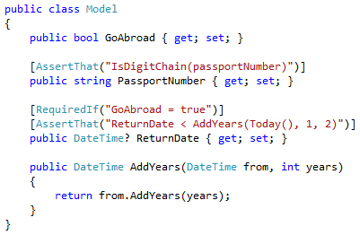
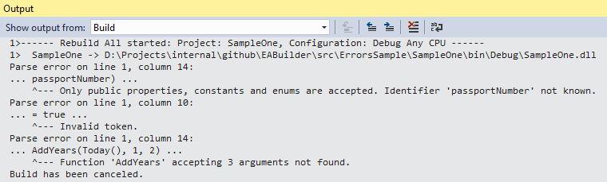

# EABuilder

ExpressiveAnnotations build assistant.

Visual Studio package which shows build-time errors for broken validation expressions (expressions provided to attributes given by [ExpressiveAnnotations](https://github.com/jwaliszko/ExpressiveAnnotations) conditional validation library).

Code sample:

Build output:

